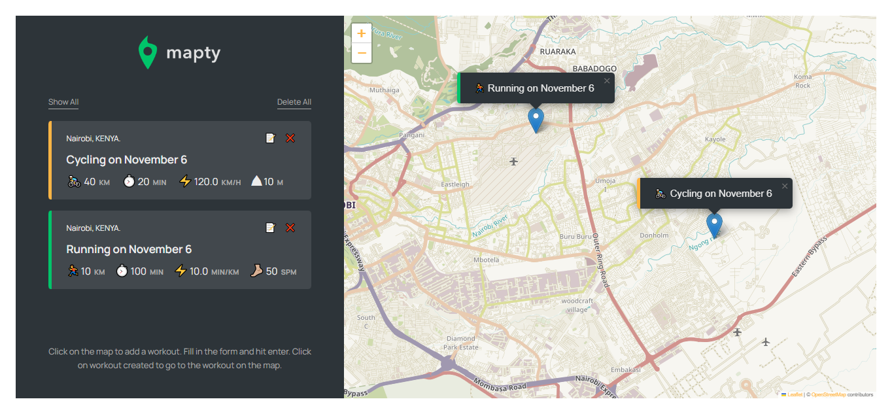

# Mapty Workout App

## Welcome! 👋

This is a very simple workout app that can log in running workouts and cycling.

For running workouts you will need to fill out; Distance, Duration and Cadence, then the app will automatically calculate the Pace.

For cycling exercises you will need to fill out; Distance, Duration and Elevation Gain, then the app will automatically calculate the Speed.

## How it works

The app needs your location settings turned on your browser which will load your current location on the map.
Then you will click where your workout took place and a form will appear to fill in the details.
To submit you just need to hit ENTER.
The workout will be saved on your local storage and loaded on the side bar.

## Technologies Used

1. HTML
2. CSS (Grid / Flex)
3. Vanilla JavaScript (APIs - Leaflet Maps, LocationIQ Geocoding)
